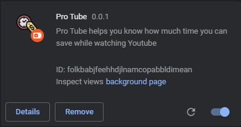
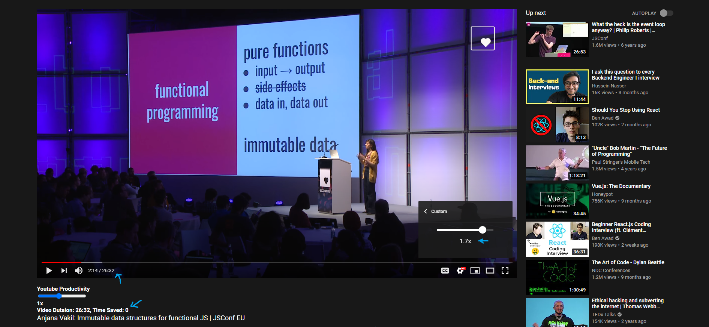
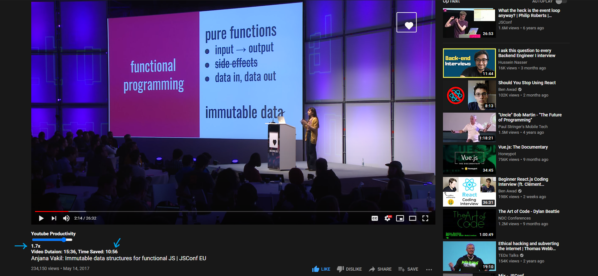

# ProTube-Chrome-Extension

### ProTube helps you know how much time you can save while watching YouTube

In this **26:32** minutes talk of Immutable Data Structures for funtional JS, We can easily figue out how much time we can save watching the video on different watch speed and in how much time the video will end.

#### At a watch speed of **1.7x**
#### New Duration: **15:36** minutes
#### Time Saved: **10:56** minutes 

